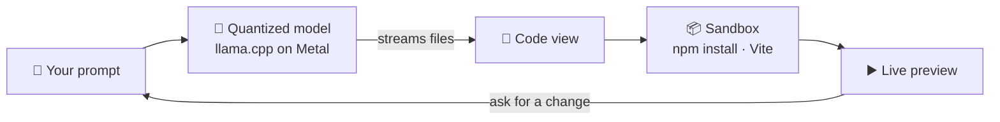

<div align="center">


# Jemero

**Your offline coding agent.**<br/>
Local · Offline · Free

<br/>

[](https://github.com/obcraft/Jemero/releases/latest/download/Jemero-arm64.dmg)
&nbsp;
[](https://obcraft.github.io/Jemero/)

[](https://github.com/obcraft/Jemero/releases/latest)


<br/>


</div>

<br/>

Describe an app in one sentence. Jemero writes it with an AI model that runs **on your
Mac**, installs it, and runs it live in the window — then you keep asking for changes in
plain words. No cloud, no account, no API key, nothing to set up.

## Highlights

|  |  |
|---|---|
| **Built-in AI runtime** | llama.cpp ships inside the app and runs on the GPU. No terminal, no other apps. |
| **Sized to your Mac** | Jemero reads your chip and memory and marks the best model that fits — already quantized for speed. |
| **One-click models** | 15 verified coding models. Downloads resume if interrupted and are checked against Hugging Face's SHA-256. |
| **Live preview** | The generated app runs in a sandbox right in the window. Missing packages and imports are fixed for you. |
| **Private** | Everything happens on your Mac. Nothing you type leaves it. |
| **Light on your Mac** | Closing Jemero stops the model and hands its memory straight back to macOS. |

## Install

1. **[Download Jemero-arm64.dmg](https://github.com/obcraft/Jemero/releases/latest/download/Jemero-arm64.dmg)**, open it, and drag Jemero into **Applications**.
2. Open Jemero. The first time, macOS asks once: go to **System Settings → Privacy & Security** and click **Open Anyway**.
3. The model list opens with the best model for your Mac marked **Best**. Click **Get** — it downloads, starts, and drops you straight into the chat.

> [!NOTE]
> Requires an Apple Silicon Mac (M1 or later) on macOS 13+. Models take 1.5–60 GB of disk space depending on size.

## Powered by quantization

A coding model is billions of numbers. Quantization stores each one in fewer bits, so the
model becomes several times smaller and faster while keeping nearly all of its ability.
Jemero picks the level that fits your Mac's memory and still runs fast.

<div align="center">

| Qwen2.5-Coder 14B | File size | Fits a 24 GB Mac |
|:--|--:|:-:|
| 16-bit (original) | 29.6 GB | ✗ |
| 8-bit | 15.7 GB | ✓ |
| 5-bit | 10.5 GB | ✓ |
| **4-bit** | **9.0 GB** | ✓ — **24 tokens/s** on an M4 Pro |

</div>

<details>
<summary><b>How Jemero picks a model for your Mac</b></summary>

<br/>

On Apple Silicon, generating a token means reading every active weight from memory once,
so speed is a memory-bandwidth problem:

```
tokens/sec ≈ 0.75 × memory bandwidth ÷ bytes read per token
```

The 0.75 is calibrated, not assumed: Qwen2.5-Coder 14B at 4-bit measured 24.5 tok/s on
an M4 Pro (273 GB/s), and the formula predicts 24.

- **Fit** — weights + KV cache at 16k context + compute buffers must fit the model
  budget: unified memory minus ~6 GB for the app, the sandbox and macOS, and at most
  Metal's wired limit minus 1.5 GB.
- **Speed** — dense models read all their weights per token; a mixture-of-experts reads
  only its active experts, which is why a 30B MoE can outrun a dense 14B.
- **Quantization** — the best-quality level that still meets the speed target. Nothing
  below 4-bit is offered.
- **Priority** (Settings → Generation) — *Speed* wants 35+ tok/s, *Balance* 20+,
  *Quality* accepts down to 10 for a stronger model.

Every size in the catalog is the real byte count of the real file, and every KV figure
comes from the model's own config — so "too big" is a fact, not a guess. Run
`npm run models` to see the ranking for your own Mac.

</details>

## How it works



The model writes complete files into a React + Vite project that already includes
Tailwind, shadcn/ui components, icons and charts, so even a small model produces
something that looks designed. Files appear while the model is still typing; packages
install in parallel; the preview hot-reloads on every follow-up.

## Settings

|  |  |
|---|---|
| **General** | Theme (system, dark, light) · animations · thinking on/off · show reasoning · follow the build between tabs · auto-fix imports · auto-install packages |
| **Generation** | Model priority · answer length · memory · temperature · top-p |
| **System prompt** | Edit or replace the built-in prompt |

**Shortcuts:** <kbd>⌘</kbd> <kbd>L</kbd> models · <kbd>⌘</kbd> <kbd>,</kbd> settings · <kbd>⌘</kbd> <kbd>↵</kbd> generate · <kbd>Esc</kbd> stop

---

## Development

```bash
git clone https://github.com/obcraft/Jemero.git && cd Jemero
npm install
npm start          # the app, with hot reload
npm run dist       # → release/Jemero-arm64.dmg
```

<details>
<summary><b>Scripts</b></summary>

<br/>

| Script | |
|---|---|
| `npm start` | Run the app in development |
| `npm run models` | What this Mac should run, and why (`--priority speed\|quality`, `--json`) |
| `npm run models:install` | Download the recommendation (`-- --install <id>` for another) |
| `npm run serve` / `npm run stop` | Start / stop the model server without the window |
| `npm run dist` | Build `release/Jemero-arm64.dmg` |
| `npm run runtime` | Re-vendor the llama.cpp runtime into `vendor/llama` |
| `npm run icon` / `npm run dmg:background` | Redraw the app icon / the DMG window |

</details>

<details>
<summary><b>Architecture</b></summary>

<br/>

```
prompt ──► llama-server (built in, Metal) ──► <file> blocks ──► WebContainer
             127.0.0.1:8757/v1                                  npm install
             via same-origin proxy at /llm                       npm run dev
                                                                 └─► preview
```

| File | Role |
|---|---|
| `electron/runtime.cjs` | The inference runtime: llama.cpp's official `llama-server`, pinned to one build. Bundled in the app, vendored for development, or fetched once as a fallback. |
| `electron/model.cjs` | Starts, stops and switches the server; remembers your last model; only ever stops its own process. |
| `electron/hardware.cjs` · `catalog.cjs` | Read the Mac (chip, memory, GPU cores, bandwidth) and rank the model catalog for it. |
| `electron/install.cjs` | The model store: resumable, SHA-256-verified downloads. |
| `src/lib/llm.ts` | Streaming OpenAI-compatible client; keeps reasoning out of the file stream. |
| `src/lib/parser.ts` | Pulls `<file>` and `<install>` blocks out of the stream as it arrives. |
| `src/lib/template.ts` · `uikit.ts` | The Vite + React scaffold and design system the model builds on. |
| `src/lib/deps.ts` · `imports.ts` | Install undeclared packages; add forgotten component imports. |
| `src/lib/settings.ts` | Settings, persisted by the main process. |

Two details that matter:

1. **Cross-origin isolation.** WebContainer needs `SharedArrayBuffer`, so the page is
   served with `COOP: same-origin` and `COEP: require-corp`.
2. **The model is proxied.** `/llm/*` → `127.0.0.1:8757/v1/*`, in both the dev server and
   the packaged app, which keeps requests same-origin under cross-origin isolation.

The model's output format — full files every time, no diffs:

```
<file path="src/App.jsx">
export default function App() { return <h1>Hi</h1> }
</file>

<install>recharts date-fns</install>
```

</details>

<details>
<summary><b>Performance</b></summary>

<br/>

`llama-server` runs with:

| Flag | Why |
|---|---|
| `--n-gpu-layers 999` | Every layer on the GPU; unified memory means no copy cost |
| `--flash-attn auto` | On wherever the model supports it |
| f16 KV cache | An 8-bit cache halved prompt speed on Metal and broke small models |
| `--parallel 1 --kv-unified` | One conversation gets the whole context |
| `--jinja` | Each model's own chat template, so every model family is prompted correctly |
| `--reasoning-format auto` | Thinking comes back separately, never mixed into the files |

**Thinking** is off by default, so hybrid models answer straight away. It's sent per
request through the model's own template, so it works for any model that supports it.
If a model ever degenerates into one repeated character, generation stops with a clear
error instead of streaming noise.

In the app, the stream is parsed every 70 ms instead of per token, panes are memoized,
terminal writes are batched and vendor code is split out — the app's own bundle is 59 kB.

</details>

<details>
<summary><b>Configuration</b></summary>

<br/>

| Variable | Default | |
|---|---|---|
| `JEMERO_MODEL` | Last pick, else the recommendation | Serve this model id at startup |
| `JEMERO_URL` | `http://127.0.0.1:8757` | Where the model server listens |
| `JEMERO_HOME` | `~/Library/Application Support/Jemero` | Models, runtime, logs, settings |
| `JEMERO_LLAMA_BIN` | The bundled runtime | Use your own `llama-server` build |
| `JEMERO_KEEP_WARM` | — | `1` keeps the model loaded after quitting |
| `JEMERO_DEV_PORT` | A free port | Pin the dev server |
| `JEMERO_OPEN` | — | `models` or `settings`: open straight onto that panel |
| `JEMERO_THEME` | The OS | `light` or `dark` for this run |
| `JEMERO_CAPTURE` | — | Write a PNG of the window once loaded |

Server log: `~/Library/Application Support/Jemero/logs/llama-server.log`

</details>

<details>
<summary><b>Packaging &amp; releasing</b></summary>

<br/>

The app carries `llama-server` and its Metal libraries in `Contents/Resources/llama`,
so a fresh Mac needs nothing but a model download. `electron-builder.config.cjs` picks
the signing mode from the environment:

| Mode | When | What users get |
|---|---|---|
| **Ad-hoc** (default) | No certificate present | A sealed bundle; macOS asks once via *Open Anyway* |
| **Developer ID + notarized** | `CSC_NAME` (or `CSC_LINK`) plus `APPLE_ID`, `APPLE_APP_SPECIFIC_PASSWORD`, `APPLE_TEAM_ID` | Opens with no warning at all |

To release: bump `version` in `package.json`, then

```bash
npm run dist
gh release create v0.2.0 release/Jemero-arm64.dmg --title "Jemero 0.2.0"
```

The DMG name has no version in it, so the download link — `releases/latest/download/Jemero-arm64.dmg` —
always serves the newest release. The website is `docs/index.html`, served by GitHub Pages
from `/docs`. To move to a newer llama.cpp, bump `BUILD` in `electron/runtime.cjs` and run
`npm run runtime`.

</details>

<details>
<summary><b>Known limits</b></summary>

<br/>

- Speed figures are estimates from the bandwidth model (±20%); the ranking is the reliable part.
- One sandbox per window, and projects aren't saved between sessions yet.
- Follow-ups rewrite whole files rather than patching them.
- A 14B model occasionally breaks the output format; the error comes with a one-click repair pass.

</details>
