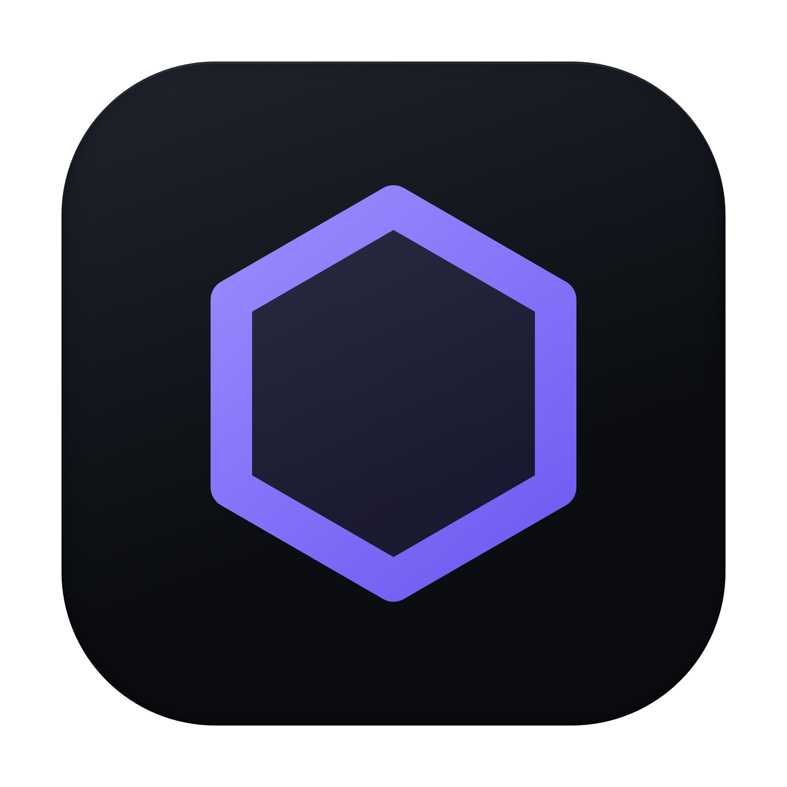
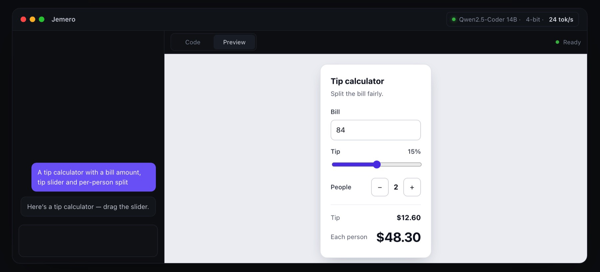
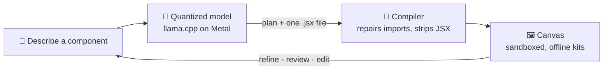

<div align="center">



# Jemero

**Your offline component studio.**<br/>
Local · Offline · Free

<br/>

[](https://github.com/obcraft/Jemero/releases/latest/download/Jemero-arm64.dmg)
&nbsp;
[](https://obcraft.github.io/Jemero/)

[](https://github.com/obcraft/Jemero/releases/latest)


<br/>



</div>

<br/>

Describe a UI component, block or section. Jemero designs and builds it with an AI model
that runs **on your Mac**, using the UI kit you pick, and renders it live on a canvas:
just the component, interactive, in milliseconds. Then you keep refining it, ask for a
review, step back through versions or edit the code yourself. No cloud, no account, no
API key, nothing to install.

## Highlights

|  |  |
|---|---|
| **Built-in AI runtime** | llama.cpp ships inside the app and runs on the GPU. No terminal, no other apps. |
| **Sized to your Mac** | Jemero reads your chip and memory and marks the best model that fits, already quantized for speed. |
| **One-click models** | 43 verified coding and general models, starting at 135M parameters, and a search that finds any chat model on Hugging Face (Gemma, Llama, Phi, Qwen…), sized for your Mac the same way. Downloads resume if interrupted and are checked against Hugging Face's SHA-256. |
| **Any component** | Components (pickers, inputs, menus), blocks (forms, cards, panels) or full-width sections (heroes, pricing, footers). |
| **Your UI kit** | shadcn/ui or plain Tailwind, bundled in the app. Switch kits and Jemero rebuilds the component with the new one. |
| **Live canvas** | Only the component, rendered offline in milliseconds, with its states side by side, light/dark and phone/tablet/desktop widths. |
| **Refine and review** | Plan first, then code. Ask for a review, tick the points worth fixing, apply them. Every change is a version you can go back to. |
| **Private** | Everything happens on your Mac. Nothing you type leaves it. |
| **Light on your Mac** | Closing Jemero stops the model and hands its memory straight back to macOS. |

## Install

1. **[Download Jemero-arm64.dmg](https://github.com/obcraft/Jemero/releases/latest/download/Jemero-arm64.dmg)**, open it, and drag Jemero into **Applications**.
2. Open Jemero. The first time, macOS asks once: go to **System Settings → Privacy & Security** and click **Open Anyway**.
3. The model list opens with the best model for your Mac marked **Best**. Click **Get**: it downloads, starts, and drops you straight into the studio.

> [!NOTE]
> Requires an Apple Silicon Mac (M1 or later) on macOS 13+. Models take 1.5 to 60 GB of disk space depending on size.

## Powered by quantization

A coding model is billions of numbers. Quantization stores each one in fewer bits, so the
model becomes several times smaller and faster while keeping nearly all of its ability.
Jemero picks the level that fits your Mac's memory and still runs fast.

<div align="center">

| Qwen2.5-Coder 14B | File size | Fits a 24 GB Mac |
|:--|--:|:-:|
| 16-bit (original) | 29.6 GB | ✗ |
| 8-bit | 15.7 GB | ✓ |
| 5-bit | 10.5 GB | ✓ |
| **4-bit** | **9.0 GB** | ✓ · **24 tokens/s** on an M4 Pro |

</div>

<details>
<summary><b>How Jemero picks a model for your Mac</b></summary>

<br/>

On Apple Silicon, generating a token means reading every active weight from memory once,
so speed is a memory-bandwidth problem:

```
tokens/sec ≈ 0.75 × memory bandwidth ÷ bytes read per token
```

The 0.75 is calibrated, not assumed: Qwen2.5-Coder 14B at 4-bit measured 24.5 tok/s on
an M4 Pro (273 GB/s), and the formula predicts 24.

- **Fit:** weights + KV cache at the selected context + compute buffers must fit the model
  budget: unified memory minus ~6 GB for the app, the sandbox and macOS, and at most
  Metal's wired limit minus 1.5 GB.
- **Speed:** dense models read all their weights per token; a mixture-of-experts reads
  only its active experts, which is why a 30B MoE can outrun a dense 14B.
- **Quantization:** the best-quality level that fits and balances the speed target. No model
  is hidden just for being small; Hub search also offers lower-bit and full-precision GGUFs.
- **Priority** (Settings → Generation): *Speed* wants 35+ tok/s, *Balance* 20+,
  *Quality* accepts down to 10 for a stronger model.

Every size in the catalog is the real byte count of the real file, and every KV figure
comes from the model's own config, so "too big" is a fact, not a guess. Run
`npm run models` to see the ranking for your own Mac.

**Models** opens on the full catalog, with models that exceed this Mac’s memory or
runtime capabilities disabled. Filter by parameter count (including 1B or smaller),
or sort smallest first. Gemma 270M/1B, SmolLM2 135M/360M, Qwen, Llama, Phi and others
are available immediately, without a search.

**Search** goes beyond the catalog: type a name (`gemma 1b`, `llama 3b`, `phi 4`),
a Hugging Face repository ID, or its URL. Results are paginated with **Load more**;
there is no popularity cutoff. Each public single-file GGUF is sized using its actual
file size and GGUF metadata. Subfolders are supported. Gated repositories require
access approval and are not currently downloadable in-app; split GGUFs and non-language
models are excluded. Unknown runtime architectures remain disabled.

Context defaults to 16k and reduces when needed, down to 512 tokens. Shorter native
windows (such as SmolLM2’s 8k and TinyLlama’s 2k) are usable. Before generation, the app
counts the formatted prompt with the running model’s tokenizer and caps the answer to
available context; an oversized prompt gets an actionable error. Fit and speed are
estimates, not a guarantee that every community upload will load or produce good code.

`npm run models -- --search "gemma 1b"` also searches from a terminal.
`node scripts/refresh-small-catalog.mjs` refreshes the bundled small-model metadata
from Hugging Face without downloading weights.

</details>

## How it works



Every UI kit is bundled into the app ahead of time, so a component renders the moment the
model closes its file: no `npm install`, no dev server, no network. The model writes one
file per component: the component itself, a `Preview` with realistic sample data, and
optionally a few named `variants` (empty, error, disabled…) that the canvas shows side by
side. Before anything renders, Jemero repairs what small models get wrong: a forgotten
import, an icon name that doesn't exist, a package that isn't installed.

- **Refine** in plain words, or with one click on a suggestion.
- **Review**: the model critiques its own component (accessibility, states, polish); you
  pick the points worth fixing and apply them as one change.
- **Versions**: every change is kept. Step back, and refine from any version.
- **Code**: edit by hand and the canvas follows as you type. Copy the component and the
  kit files it uses straight into a project.
- **Console**: what the component logs, form submissions and React's warnings, for testing.

## Settings

|  |  |
|---|---|
| **General** | Theme (system, dark, light) · animations · thinking on/off · show reasoning · plan before coding · watch the code being written · repair imports |
| **Generation** | Model priority · answer length · temperature · top-p |
| **System prompt** | Edit or replace the built-in rules (the output format and kit brief are always added) |

**Shortcuts:** <kbd>⌘</kbd> <kbd>L</kbd> models · <kbd>⌘</kbd> <kbd>,</kbd> settings · <kbd>⌘</kbd> <kbd>↵</kbd> generate · <kbd>Esc</kbd> stop

---

## Development

```bash
git clone https://github.com/obcraft/Jemero.git && cd Jemero
npm install
npm start          # the app, with hot reload (bundles the UI kits on first run)
npm run dist       # → release/Jemero-arm64.dmg
```

<details>
<summary><b>Scripts</b></summary>

<br/>

| Script | |
|---|---|
| `npm start` | Run the app in development |
| `npm run kits` | Rebuild the canvas's UI kit bundles into `public/kits` (automatic when an input changed) |
| `npm run models` | What this Mac should run, and why (`--priority speed\|quality`, `--json`, `--search "gemma 1b"`) |
| `npm run models:install` | Download the recommendation (`-- --install <id>` for another, `-- --search "…" --install <id>` for a search result) |
| `npm run serve` / `npm run stop` | Start / stop the model server without the window |
| `npm run dist` | Build `release/Jemero-arm64.dmg` |
| `npm run runtime` | Re-vendor the llama.cpp runtime into `vendor/llama` |
| `npm run icon` / `npm run dmg:background` | Redraw the app icon / the DMG window |

</details>

<details>
<summary><b>Architecture</b></summary>

<br/>

```
prompt ──► llama-server (built in, Metal) ──► <plan> + <file> ──► compiler ──► canvas
             127.0.0.1:8757/v1                                   sucrase       sandboxed iframe
             via same-origin proxy at /llm                       import fixes  import map → /kits
```

| File | Role |
|---|---|
| `electron/runtime.cjs` | The inference runtime: llama.cpp's official `llama-server`, pinned to one build. Bundled in the app, vendored for development, or fetched once as a fallback. |
| `electron/model.cjs` | Starts, stops and switches the server; remembers your last model; only ever stops its own process. |
| `electron/hardware.cjs` · `catalog.cjs` | Read the Mac (chip, memory, GPU cores, bandwidth) and rank the model catalog for it. |
| `electron/hub.cjs` · `gguf.cjs` | Hugging Face search: finds GGUF chat models, reads each one's header over a range request, and sizes it with the catalog's own rules. |
| `electron/install.cjs` | The model store: resumable, SHA-256-verified downloads. A model found through search keeps its catalog entry in its `model.json`. |
| `scripts/kits.mjs` | Bundles every kit package (React 19, Radix, lucide, motion…) as shared-chunk ESM into `public/kits`, with an import map and a manifest of every export. |
| `kits/` | The canvas (`stage.html`, `stage.js`), the shadcn/ui sources and the Tailwind theme. |
| `src/lib/compile.ts` | Adds forgotten imports, maps icon names onto lucide, rewrites deep imports, rejects what isn't installed with a message the model can act on, then transpiles with sucrase. |
| `src/lib/systemPrompt.ts` · `kits.ts` | The brief: base rules, the kit's API notes, and the size of what's being built. Follow-ups are stateless: current code plus earlier requests. |
| `src/lib/library.ts` | Components, versions and conversations, in `library.json`. |
| `src/lib/llm.ts` · `parser.ts` | Streaming client; pulls `<plan>`, `<file>` and `<review>` out of the stream as it arrives. |

Two details that matter:

1. **The canvas is sandboxed.** Generated code runs in an iframe with only `allow-scripts
   allow-forms`, so it has an opaque origin: it can't reach the app, its storage or the
   model bridge. The kit bundles are served with CORS so it can still import them.
2. **The model is proxied.** `/llm/*` → `127.0.0.1:8757/v1/*`, in both the dev server and
   the packaged app, which keeps requests same-origin.

The model's output format:

```
<plan>
- Anatomy: trigger, panel, search field, list
</plan>
<file path="SearchableSelect.jsx">
export function SearchableSelect(props) { … }
export default function Preview() { return <SearchableSelect … /> }
export const variants = { Empty: () => <SearchableSelect items={[]} /> }
</file>
```

</details>

<details>
<summary><b>Performance</b></summary>

<br/>

`llama-server` runs with:

| Flag | Why |
|---|---|
| `--n-gpu-layers 999` | Every layer on the GPU; unified memory means no copy cost |
| `--flash-attn auto` | On wherever the model supports it |
| f16 KV cache | An 8-bit cache halved prompt speed on Metal and broke small models |
| `--parallel 1 --kv-unified` | One conversation gets the whole context |
| `--jinja` | Each model's own chat template, so every model family is prompted correctly |
| `--reasoning-format auto` | Thinking comes back separately, never mixed into the files |

**Thinking** is off by default, so hybrid models answer straight away. It's sent per
request through the model's own template, so it works for any model that supports it.
If a model ever degenerates into one repeated character, generation stops with a clear
error instead of streaming noise.

In the app, the stream is parsed every 70 ms instead of per token and panes are memoized.
A component renders as soon as its file closes: compiling takes a few milliseconds and the
canvas imports it in tens, because every kit is already bundled and loaded.

</details>

<details>
<summary><b>Configuration</b></summary>

<br/>

| Variable | Default | |
|---|---|---|
| `JEMERO_MODEL` | Last pick, else the recommendation | Serve this model id at startup |
| `JEMERO_URL` | `http://127.0.0.1:8757` | Where the model server listens |
| `JEMERO_HOME` | `~/Library/Application Support/Jemero` | Models, runtime, logs, settings |
| `JEMERO_LLAMA_BIN` | The bundled runtime | Use your own `llama-server` build |
| `JEMERO_KEEP_WARM` | none | `1` keeps the model loaded after quitting |
| `JEMERO_DEV_PORT` | A free port | Pin the dev server |
| `JEMERO_OPEN` | none | `models` or `settings`: open straight onto that panel |
| `JEMERO_THEME` | The OS | `light` or `dark` for this run |
| `JEMERO_CAPTURE` | none | Write a PNG of the window once loaded |

Server log: `~/Library/Application Support/Jemero/logs/llama-server.log`

</details>

<details>
<summary><b>Packaging &amp; releasing</b></summary>

<br/>

The app carries `llama-server` and its Metal libraries in `Contents/Resources/llama`,
so a fresh Mac needs nothing but a model download. `electron-builder.config.cjs` picks
the signing mode from the environment:

| Mode | When | What users get |
|---|---|---|
| **Ad-hoc** (default) | No certificate present | A sealed bundle; macOS asks once via *Open Anyway* |
| **Developer ID + notarized** | `CSC_NAME` (or `CSC_LINK`) plus `APPLE_ID`, `APPLE_APP_SPECIFIC_PASSWORD`, `APPLE_TEAM_ID` | Opens with no warning at all |

To release: bump `version` in `package.json`, then

```bash
npm run dist
gh release create v0.4.0 release/Jemero-arm64.dmg --title "Jemero 0.4.0"
```

The DMG name has no version in it, so the download link
(`releases/latest/download/Jemero-arm64.dmg`) always serves the newest release. The website is `docs/index.html`, served by GitHub Pages
from `/docs`. To move to a newer llama.cpp, bump `BUILD` in `electron/runtime.cjs` and run
`npm run runtime`.

</details>

<details>
<summary><b>Known limits</b></summary>

<br/>

- Speed figures are estimates from the bandwidth model (±20%); the ranking is the reliable part.
- Only the bundled packages are available on the canvas; anything else is reported with a suggestion instead.
- Follow-ups rewrite the whole file rather than patching it.
- A 14B model occasionally breaks the output format or the code; the error comes with a one-click fix pass.

</details>
